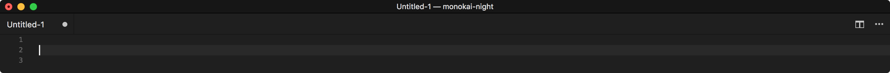
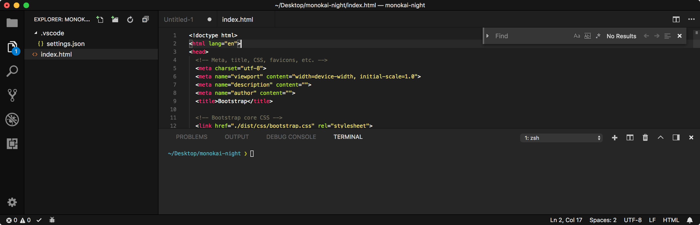

# Monokai Night

<p align="center">
  
</p>

A complete, dark and minimalistic Monokai-inspired theme.

Features:
- **Complete**: Every single themeable component has been customized.
- **Dark**: Darker than the default Monokai theme, only grayscale colors and accent colors are used.
- **Minimalistic**: Unnecessary borders have been removed, everything is well separated, it won't distract you.

## Install

Follow the instructions in the [Marketplace](https://marketplace.visualstudio.com/items?itemName=fabiospampinato.vscode-monokai-night), or run the following in the command palette:

```shell
ext install fabiospampinato.vscode-monokai-night
```

## Usage

- Run the `Preferences: Color Theme` command.
- Select `Monokai Night`

## Demo




## Contributing

If you found a problem, or have a feature request, please open an [issue](https://github.com/fabiospampinato/vscode-monokai-night/issues) about it.

If you want to make a pull request you can debug the extension using [Debug Launcher](https://marketplace.visualstudio.com/items?itemName=fabiospampinato.vscode-debug-launcher).

## License

MIT © Fabio Spampinato
